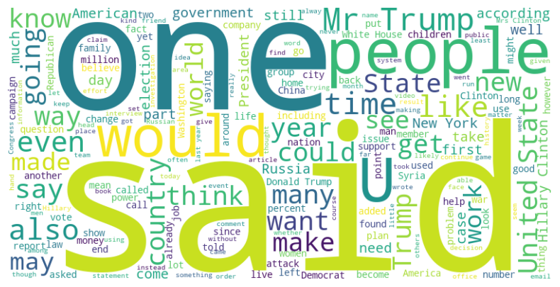

# 📰 Fake News Detection 

In a world overwhelmed by information, distinguishing credible news from fake has never been more critical. The Fake News Detection project leverages Natural Language Processing (NLP) to analyze and classify news articles, empowering users to identify misinformation with confidence.

By using advanced text analysis techniques and a robust machine learning model, this project addresses the growing concern of fake news, promoting media literacy and trust in information sources. 

Whether you’re a journalist, researcher, or an informed reader, this application serves as a powerful tool in the fight against disinformation.

Explore the synergy of technology and truth, where AI helps safeguard the integrity of information in a digital age.


# 🙌 Maintainers 👩‍💻 :

- [Vani Varanya](https://github.com/vanivaranya)
- [Saumya Gupta](https://github.com/ISaumya1011)
- [Shruti Narang](https://github.com/Shruti-Narang)

# 🙌 Contributor 👩‍💻 :

- [Saumya Gupta](https://github.com/ISaumya1011)

---

## OVERVIEW: 
The Fake News Detection project is a web application aimed at identifying and classifying news articles as real or fake. 

By analyzing the textual content of news articles, the app uses Natural Language Processing (NLP) techniques to detect misleading or false information, thereby assisting users in discerning the credibility of news sources.

---

## Key Features:
- **Text Input:** Allows users to input news article text for analysis.
- **Prediction Model:** Applies a trained NLP model to classify the input text as real or fake news.
- **Result Display:** Shows the classification result to the user, indicating the likelihood of the news being fake.

---

## ⚙️ Technical Details:
### Backend: 
Developed using Flask for handling requests and processing.
### NLP Model: 
Implements a Machine Learning model trained on labeled news datasets to perform text classification.
### Frontend: 
User interface for text input and displaying classification results.

---

## Project Category: 
Natural Language Processing

---

## 🛠️ How to Get Started  

1. **Fork this Repository**  
   Click the **Fork** button to create your copy of this repository.  

2. **Clone the Repository**  
   ```bash  
   git clone https://github.com/GDG-IGDTUW/Web-Dev-AI-ML.git  
   cd repo-name  
   ```  

3. **Navigate to Project and Setup environment**  
   Navigate to the project folder you're interested in.
   
   ```bash  
   cd Fake-News-Detector
   ```
   Now, after setting path, run following commands on command prompt.
   
   ```bash  
   python -m venv venv
   ```
   
   Followed by
   
    ```bash  
   .\venv\Scripts\activate
   ```

4. **Install Dependencies**
   Load the dataset (if any) and Install necessary Libraries
   
   Install requirements

   ```bash  
   pip install requirements.txt
   ```     

5. **In case of installation error** (Skip step 5 if successful Step 4)

   Install separate dependencies

   For example:
   ```bash  
   pip install "library_name"
   ```
6. **Install nltk dependencies**
   ```bash  
   python -m nltk.downloader stopwords punkt wordnet punkt_tab
   ```
7. **Make Your Contributions**  
   - Add Features.
   - Train models.
   - Enhance Accuracy.
   - Improve UI.
   - Test your changes.  

8. **Run and test your changes**  
   Run the Flask Application  
   For example:  
   ```bash  
   python app.py
   ```  

9. **Submit a Pull Request**  
   Push your changes and create a pull request to propose your contributions! 🎉  

---

## 🤝 Contributing Guidelines  

We ❤️ contributions! Follow these simple steps to contribute:  

1. **Browse through Issues and Choose any**  
   Browse the [Issues](#) tab and comment on the one you'd like to work on.  

2. **Clone the Repo, Make changes and Branch Out**  
   Create a new branch for your changes:  
   ```bash  
   git checkout -b feature-name  
   ```  

3. **Commit Your Work**  
   Write clear and concise commit messages:  
   ```bash  
   git commit -m "Add: Feature description"  
   ```  

4. **Push and PR**  
   Push your branch and create a pull request for review.  

---

🌟 Tips for Contributors
 - Follow the repository’s code style and structure.
 - Keep ML scripts well-indented and include comments.
 - Share any interesting results or insights in the pull request description.
 - If you want an issue to be assigned to you, Tag us and mention so under the issue.
 - Please be patient and Feel free to Tag the maintainers or collaborators for any queries. ❤️

---

Happy Coding and Collaborating!🚀❤️
